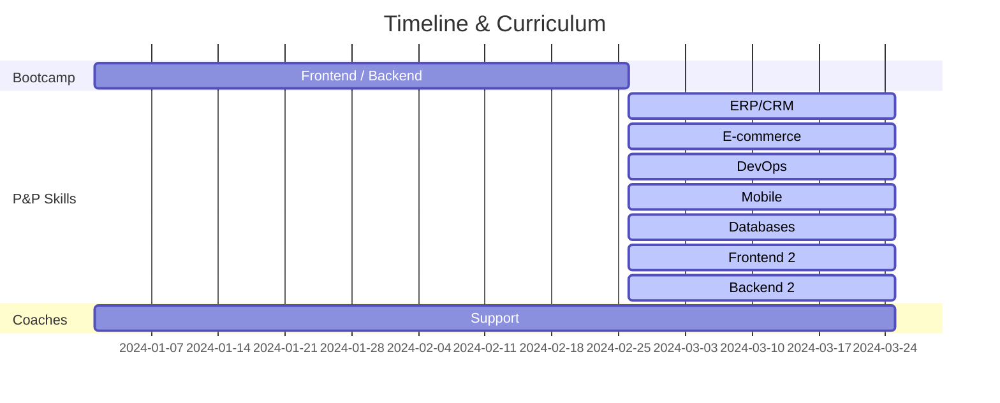

# P&P Skills

## Curriculum BC

**Frontend**: HTML, CSS, JavaScript, Typescript, React, Angular

**Backend**: Node/Express, Java/Spring, SQL, Docker

## Módulos P&P

| Categories  | Possible options  |
|---|---|
| **ERP/CRM**  | SAP S/4HANA, Salesforce, Oracle, MicrosoftDynamics  |
| **Enterprise e-commerce**  | Shopify, Adobe Commerce, BigCommerce, VTEX  |
| **DevOps**  | Kubernetes, Terraform, Ansible, Chef, AWS, Google Cloud, Azure  |
| **Mobile**  | Kotlin, Swift, React Native, Flutter  |
| **Enterprise DBs**  | Oracle, Microsoft SQL Server, IBM DB2, DynamoDB, MongoDB |
| **Frontend 2**  | React, Angular, Vue |
| **Backend 2**  | Go, Rust, Java |

